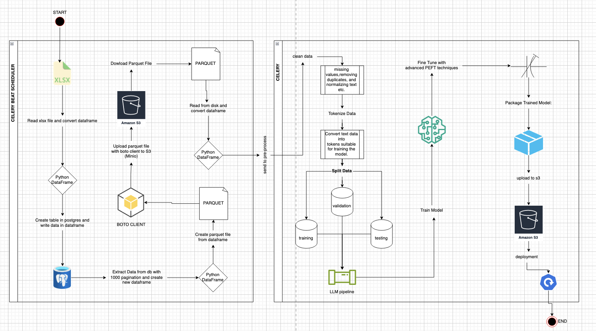

# Data Transfer and PEFT Training Workflow

This project involves a data transfer workflow from reading XLSX files to preprocessing, and a PEFT (Parameter-Efficient Fine-Tuning) training workflow for deploying a fine-tuned Large Language Model (LLM).

## Workflow


## Table of Contents

- [Data Transfer and PEFT Training Workflow](#data-transfer-and-peft-training-workflow)
  - [Workflow](#workflow)
  - [Table of Contents](#table-of-contents)
  - [Project Overview](#project-overview)
  - [Tools and Technologies](#tools-and-technologies)
  - [Data Transfer Workflow](#data-transfer-workflow)
  - [PEFT Training Workflow](#peft-training-workflow)
  - [Installation with Docker](#installation-with-docker)
  - [Update enviroment file](#update-enviroment-file)

## Project Overview

This project automates the process of reading XLSX files, converting the data into a PostgreSQL database, and transferring the data to an S3-compatible storage (Minio). Additionally, it includes a workflow for PEFT training of an LLM, deploying the trained model, and monitoring its performance.

## Tools and Technologies

- **Celery**: Distributed task queue for handling asynchronous tasks.
- **Celery Beat**: Scheduler for periodic tasks.
- **Redis**: Message broker for Celery.
- **Minio**: S3-compatible object storage.
- **PostgreSQL**: Relational database for storing data.
- **Python**: Programming language used for the scripts and tasks.

## Data Transfer Workflow

1. **Read XLSX File**: Celery Beat schedules a task to read an XLSX file from disk every minute.
2. **Convert to Pandas DataFrame**: The read data is converted into a Pandas DataFrame.
3. **Create PostgreSQL DB from DataFrame**: The DataFrame is used to populate a PostgreSQL database.
4. **Extract Data from PostgreSQL with Pagination**: Data is extracted from PostgreSQL in paginated chunks.
5. **Aggregate Data into Pandas DataFrame**: The paginated chunks are aggregated into a single DataFrame.
6. **Convert to Parquet File**: The aggregated DataFrame is converted into a Parquet file.
7. **Upload Parquet File to S3 (Minio)**: The Parquet file is uploaded to Minio storage.
8. **Download Parquet File from S3 (Minio)**: The Parquet file is downloaded from Minio.
9. **Read Downloaded Parquet File**: The downloaded Parquet file is read from disk.
10. **Send to Pre-process Task**: The read file is sent to a pre-processing task using Celery.

## PEFT Training Workflow

1. **Clean Data**: Handle missing values, remove duplicates, and normalize text.
2. **Tokenize Data**: Convert text into tokens suitable for the model.
3. **Split Data**: Divide data into training, validation, and test sets.
4. **Set Up Training Pipeline**: Initialize the training environment using the chosen LLM framework.
5. **Train Model**: Train the pre-trained LLM on the processed dataset using PEFT techniques.
6. **Validate Model**: Continuously validate the model's performance on the validation set during training.
7. **Fine-Tune Model**: Adjust hyperparameters and perform fine-tuning to improve model performance.
8. **Package Trained Model**: Serialize the trained model for deployment.
9. **Upload Model**: Upload the model to a model registry or storage service.
10. **Deploy Model**: Deploy the model to a production environment.

## Installation with Docker

1. Clone the repository:
    ```sh
    git clone git@github.com:selvianl/datalake.git
    cd datalake
    ```

2. Type the command: (first read [Update enviroment file](#update-enviroment-file))
    ```sh
    docker-compose up
    ```

## Update enviroment file
1. First update `.env` file to start-up. Be sure that `XLSX_FILE` at same location with `main.py`.

Example `.env`:
```
# Database
POSTGRES_USER=postgres
POSTGRES_PASSWORD=postgres
POSTGRES_HOST=db
POSTGRES_DB=lake
POSTGRES_PORT=5432

CELERY_BROKER_URL=redis://redis:6379/0
CELERY_RESULT_BACKEND=redis://redis:6379
CELERY_TIMEZONE=Europe/Istanbul

REDIS_URL=redis
REDIS_PORT=6379
REDIS_DB=0

# Minio
BUCKETNAME=datalake
ENDPOINT=minio
MINIO_ROOT_USER=0aVtwTRuDjNfznTQeqkf
MINIO_ROOT_PASSWORD=jqzNMqo81YsRDYpYdg0UXmHeqJStQ6IaMcehQkVi

# Constants
TABLE_NAME=data
XLSX_FILE=msgs.xlsx
```

2. After `docker-compose up` you need to create a bucket via minio by reaching `localhost:9001`. Your credentials in login page is `MINIO_ROOT_USER` and `MINIO_ROOT_PASSWORD`. Bucketname has to be same with your enviroment variable with `BUCKETNAME`.